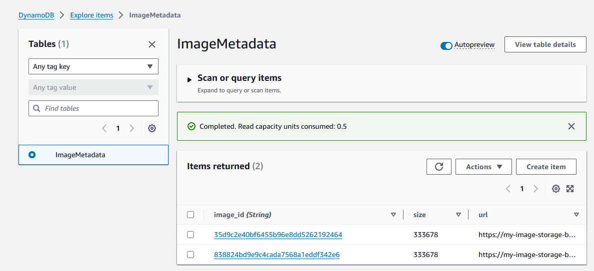
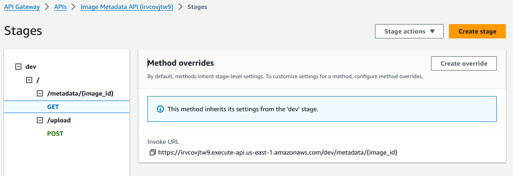
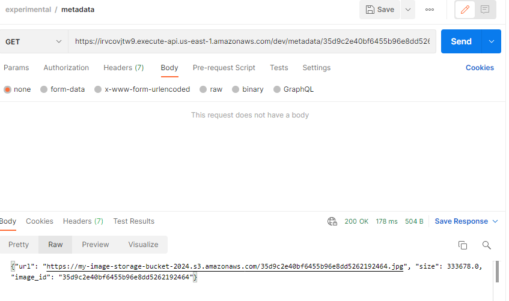

## **Proyecto Serverless: "Image Metadata API"** 
**Paso a Paso para Implementar en AWS**


A continuación, revisaremos un paso a paso para implementar el proyecto "Image Metadata API" en Amazon Web Services utilizando servicios serverless: AWS Lambda, Amazon S3, API Gateway y Amazon DynamoDB. 

La infraestructura, representada en el diagrama, y desarrollo de la aplicación en Python, nos permitirá subir imágenes a S3, almacenar los metadatos en DynamoDB y recuperar esos metadatos a través de una API REST.

#### Diagrama Aplicación Serverless: Image Metadata API


### **Paso 1: Configurar el Entorno en AWS**

**Inicia sesión** en la Consola de Administración que nos ofrace [AWS Academy Learner Lab](https://awsacademy.instructure.com/login/canvas).

### **Paso 2: Crear el Bucket S3 para Almacenamiento de Imágenes**

   - Ve a **Servicios > S3 > Crear bucket**.
   - Nombre del bucket: `my-image-storage-bucket` (debes elegir un nombre único).
   - Región: us-east-1.
   - Haz clic en **Crear bucket**.


### **Paso 3: Crear la Tabla DynamoDB para Guardar Metadatos**

   - Ve a **Servicios > DynamoDB > Tablas > Crear tabla**.
   - Nombre de la tabla: `ImageMetadata`.
   - Clave primaria: `image_id` (Tipo: String).
   - Mantén las configuraciones por defecto para lecturas y escrituras.
   - Haz clic en **Crear tabla**.




### **Paso 4: Crear las Funciones Lambda**

1. **Crear la Primera Función Lambda (`upload_image`)**:
   - Ve a **Servicios > Lambda > Crear función**.
   - Nombre de la función: `upload_image`.
   - Tiempo de ejecución: Selecciona **Python 3.x**.
   - Rol de ejecución: Selecciona **Usar rol proporcionado por el laboratorio**.
   - Haz clic en **Crear función**.
   - Copia el código proporcionado para [upload_image](./src/upload_image.py) y pégalo en el editor de código Lambda.
   - Handler: upload_image.upload_image **(recuerda que el valor depende del nombre del archivo del código y función)**

   - **Variables de Entorno**: 
     - Ve a **Configuración > Variables de entorno** y añade las siguientes:
       - `BUCKET_NAME`: Nombre del bucket de S3 (e.g., `my-image-storage-bucket`).
       - `TABLE_NAME`: Nombre de la tabla DynamoDB (`ImageMetadata`).

2. **Crear la Segunda Función Lambda (`get_image_metadata`)**:
   - Crea otra función Lambda como lo hiciste anteriormente.
   - Nombre de la función: `get_image_metadata`.
   - Copia el código proporcionado para [get_image_metadata](./src/get_image_metadata.py).
   - Handler: get_image_metadata.get_image_metadata **(recuerda que el valor depende del nombre del archivo del código y función)**

   - **Variables de Entorno**:
     - Añade `TABLE_NAME` con el valor `ImageMetadata`.


### **Paso 5: Configurar AWS API Gateway**

1. **Crear una API en API Gateway**:
   - Ve a **Servicios > API Gateway > Crear API**.
   - Selecciona **REST API**.
   - Método de creación: **New API**.
   - Nombre de la API: `ImageMetadataAPI`.

2. **Configurar los Endpoints**:
   - **POST /upload**: Configura este endpoint para conectar la API con la función `upload_image`.
     - Método: **POST**.
     - Integration Type: **Lambda Function**.
     - Selecciona la función `upload_image`.

   - **GET /metadata/{image_id}**: Configura este endpoint para conectar la API con la función `get_image_metadata`.
     - Método: **GET**.
     - Integration Type: **Lambda Function**.
     - Selecciona la función `get_image_metadata`.
     - Añade `{image_id}` como un parámetro de ruta.

3. **Deploy API**:
   - Haz clic en **Deploy API** y selecciona un stage como **dev** o crea uno nuevo.

4. **Swagger API Gateway JSON File**:
   - En caso de quedar atrapado en la configuración de los métodos de la API Gateway, se le ofrece un archivo [JSON Swagger](./src/image_metadata_api_dev_swagger_apigateway.json) para ayudarlo en el proceso y que lo importe directamente en el recurso.
   - Cree la API Gateway e importe el archivo ofrecido, recuerde reemplazar los datos necesarios en el archivo, indicados a continuación con los de su cuenta.
   - Reemplaza la región AWS si corresponde. 
   - Reemplaza {account_id} con tu ID de cuenta AWS.
   - Reemplaza {api_gw_id} el ID de la API Gateway creada.
   - En caso de que corresponda reemplaza **upload_image** y **get_image_metadata** con los nombres **exactos** de tus funciones Lambda.
   - Reemplaza con el ARN de un rol IAM que permita a API Gateway invocar las funciones Lambda (Learner Lab ya tiene un rol que le permite hacer esto).





### **Paso 6: Probar la API**

1. **Subir una Imagen (Formato JPG)**:
   - Envía una solicitud `POST` al endpoint `/upload` con la imagen en el cuerpo de la solicitud.


2. **Obtener Metadatos**:
   - Envía una solicitud `GET` al endpoint `/metadata/{image_id}`, reemplazando `{image_id}` con el ID de la imagen retornada en el paso anterior.




#### **Troubleshooting**:
   - En caso de tener problemas de permisos en la invocación de Lambda u otro recurso de la infraestructura, revise que los roles aplicados en los servicios sean los correctos.
   - En caso de continuar con problemas de invocación de las Lambdas, considere agregar el permiso con comandos de AWS CLI usando CloudShell ([Ejemplo](./src/add_lambda_permision.sh)). 
   - Apóyese también en la resolución del problema revisando los logs de Cloudwatch y usando las opciones de testing, tanto en las Lambdas como en su API Gateway. 
   - Puede mirar los logs tanto en la consola de AWS, como en el terminar usando aws-cli:

```
   aws logs tail /aws/lambda/get_image_metadata --follow
```

### **Conclusión**

Este proyecto te permitirá aplicar una infraestructura completamente serverless en AWS, mostrando la integración de servicios como Lambda, S3, DynamoDB y API Gateway para construir una API funcional que maneje el almacenamiento y la consulta de imágenes.
